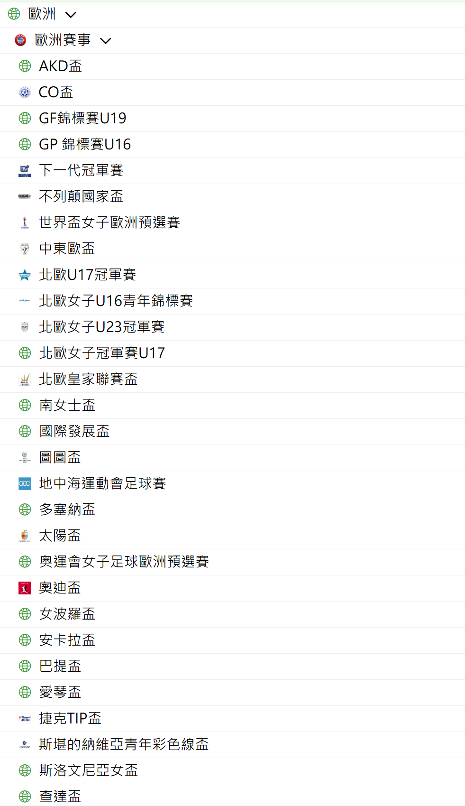

# 熱門球賽

- [link](https://m.lmgoal.com/data)

> - 表目錄
> 1. [歐洲聯賽冠軍盃](#歐洲聯賽冠軍盃)
> 2. [歐洲聯賽歐霸盃](#歐洲聯賽歐霸盃歐聯)
> 3. [歐洲協會聯賽](#歐洲協會聯賽)
> 4. [英格蘭超級聯賽](#英格蘭超級聯賽)
> 5. [法國甲組聯賽](#法國甲組聯賽)
> 6. [德國甲組聯賽](#德國甲組聯賽)
> 7. [義大利甲組聯賽](#義大利甲組聯賽)
> 8. [西班牙甲組聯賽](#西班牙甲組聯賽)

### 彙整

- 歐洲足球協會聯盟 UEFA 主辦的比賽，從層級高到低有歐洲聯賽冠軍盃(第一級)、歐洲聯賽歐霸盃(第二級)和歐洲協會聯賽(第三級)等，依據這樣的關係可以將歐冠和歐盃一起看或是歐霸和歐協聯一起看，以球隊隊伍實力分析的時候差異比較不會這大。不確定這樣的理解是否恰當。
- 英超、法甲、德甲、義甲和西甲的部分，比較偏國家區域內的競爭比賽。
- ~~其他疑問: 我們主要API接過來的資料是以俱樂部為主嗎( 歐冠（UCL）、歐霸（UEL）、 歐洲協會聯賽（UECL）、歐洲超級盃（UEFA Super Cup）、歐洲超級盃（UEFA Super Cup）)?因為根據網頁沒有看到歐洲國家盃（UEFA Euro）和歐洲國家聯賽（UEFA Nations League）等國家隊，還是我疏漏了。我誤會了。~~ 我發現挺複雜的

>  歐洲超級盃（UEFA Super Cup）:歐冠 vs 歐霸冠軍對決一場定勝負

$\blue\bigstar$   [回到表目錄](#熱門球賽)

## 歐洲聯賽冠軍盃

- 中文名稱：歐洲聯賽冠軍盃
- 英文名稱：UEFA Champions League
- 簡稱：UCL
- 改制時間：1992年改為現行「歐洲聯賽冠軍盃」制度，並加入小組賽階段，增加比賽精彩度與商業價值。
 
- 參賽隊伍：來自歐洲各國的頂級聯賽前幾名球隊（根據 UEFA 積分排名決定名額）
- 比賽階段：
    - 資格賽 / 附加賽（非所有隊伍都有，低排名聯賽隊伍先打）
    - 小組賽：32 支球隊分成 8 組，每組 4 隊進行主客場雙循環
    - 淘汰賽：從 16 強起一路打到決賽，採主客場制（除了決賽為單場定勝負）
- 決賽地點：每年 UEFA 事先選定場館（通常在歐洲大型城市）
 
- 參賽隊伍的選拔方式: 依照上季各國聯賽名次決定
- 每個國家的頂級聯賽，根據球隊在上一個賽季的最終名次，決定哪些球隊能參加 UCL。
    - 例如：英格蘭超級聯賽前 4 名通常能直接進入 UCL 小組賽。
- 名額不是平均分配，而是根據 UEFA 積分排名決定
    - UEFA 會依據各國俱樂部在歐洲賽事的表現，計算一個**聯賽係數（country coefficient）**。
    - 積分越高的國家，獲得的 UCL 名額就越多。
    - 排名前列的聯賽（如英超、西甲、德甲、義甲）：最多可有 4 隊直接晉級
    - 排名較低的聯賽（如塞爾維亞、匈牙利、芬蘭）：可能只有 1 隊，且需從資格賽打起
- 資格賽與附加賽
    - 沒有直接晉級的球隊，需要從數輪資格賽開始打起，逐步晉級到小組賽。
- 特殊情況
    - 衛冕冠軍保送參賽：若某隊奪得 UCL 冠軍，但在本國聯賽未獲得資格，仍可自動獲得參賽資格。
    - 歐洲聯賽（Europa League）冠軍：也能獲得下一季的 UCL 參賽資格。
 

$\blue\bigstar$   [歐洲聯賽冠軍盃](#歐洲聯賽冠軍盃賽)

### 資格賽 / 附加賽基本架構

| 路線名稱                     | 參加對象                       | 目標            |
| ------------------------ | -------------------------- | ------------- |
| **冠軍路徑（Champions Path）** | 各國聯賽冠軍，但來自低排名聯賽（如波蘭、芬蘭等）   | 讓更多小聯賽冠軍有晉級機會 |
| **聯賽路徑（League Path）**    | 來自高排名聯賽的非冠軍隊（如英超第 4、西甲第 4） | 爭取剩餘小組賽名額     |

1. 冠軍路徑（約有 43 隊）
初賽輪（Preliminary Round）：4 隊，踢半決賽和決賽（單場）

>第一輪資格賽（1QR）：30 隊
>第二輪資格賽（2QR）：20 隊（10+來自前一輪晉級）
>第三輪資格賽（3QR）：12 隊（部分直接晉級）
>附加賽（Play-off Round）：8 隊
✅ 最終有 5 隊可晉級正賽小組賽

2. 聯賽路徑（約有 10 隊）
第二輪或第三輪開始（取決於聯賽排名）
> 通常有 4 隊進入附加賽階段
✅ 最終有 2 隊可晉級正賽小組賽

| 來源           | 名額                       |
| ------------ | ------------------------ |
| 資格賽與附加賽晉級    | **7 隊**（5 冠軍路徑 + 2 聯賽路徑） |
| 自動晉級小組賽      | **25 隊**（來自高積分聯賽、包括衛冕冠軍） |
| **總計小組賽球隊數** | **32 隊**                 |

$\blue\bigstar$   [歐洲聯賽冠軍盃](#歐洲聯賽歐霸盃歐聯)

### 小組賽詳細說明（32 強階段）
- 基本規則：
    - 球隊總數：32 隊
    - 分組方式：分成 8 組（A~H 組）
    - 每組球隊：4 支隊伍

- 對戰方式：主客場「雙循環」，即每隊與其他三隊各踢兩場（主場與客場）

- 勝負積分制度：
    - 勝 = 3 分
    - 平 = 1 分
    - 負 = 0 分

- 每組有 ${4\choose2}=6$ 個配對，每對球隊踢兩場（主+客）→ 6 配對 × 2 = 12 場比賽／組，共 8 組 × 12 場 = 96 場比賽總數（在小組賽階段）
- 每組前兩名晉級 16 強淘汰賽
    - 第三名會掉到歐洲聯賽（Europa League）的淘汰賽階段
    - 第四名直接淘汰，結束歐戰

| 項目   | 小組賽             | 淘汰賽               |
| ---- | --------------- | ----------------- |
| 賽制   | 循環賽             | 淘汰制（單敗）           |
| 對戰方式 | 主客場雙循環（每隊踢 6 場） | 主客場各一場（除了決賽）      |
| 賽果計算 | 以積分決定排名         | 以總進球數決定晉級（兩回合累計）  |
| 比賽數量 | 固定 6 場／隊        | 視晉級而定（最多 7 場）     |
| 平手處理 | 可以平手，給 1 分      | 若總進球平手 → 加時賽 → 點球 |

- 淘汰賽階段包括：
    - 16 強
    - 8 強（四分之一決賽）
    - 4 強（準決賽）
    - 決賽：單場定勝負，中立場地舉行

| 比賽模式         | 小組賽（積分制）        | 淘汰賽（晉級制） |
| ------------ | --------------- | -------- |
|          |穩定性高，可有敗場仍晉級 | 每一回合都攸關生死       |          
|          |每隊固定 6 場比賽   | 視晉級情況而定（最多 7 場） |          
|          |打平也是結果之一     | 平手需進入延長／點球解決勝負  |     

 
Hint: 小組第三名「轉戰」歐洲聯賽（UEFA Europa League）
小組賽結束後，每組排名 第 3 名 的隊伍 無法晉級歐冠 16 強淘汰賽。

但這些隊伍 並不完全淘汰出歐洲賽場，而是：
進入 歐洲聯賽（Europa League）淘汰賽附加賽（Knockout Round Play-Offs）。

- 歐冠（UCL）→ 歐聯（UEL）之間的聯動機制整理如下：

| 小組名次     | 結果                              |
| -------- | ------------------------------- |
| 🥇 第 1 名 | 晉級 UCL 16 強淘汰賽                  |
| 🥈 第 2 名 | 晉級 UCL 16 強淘汰賽                  |
| 🥉 第 3 名 | **轉降至 Europa League（歐聯）淘汰賽附加賽** |
| 🥹 第 4 名 | 完全淘汰，不參加任何歐洲賽事                  |

- 那歐聯（UEL）這邊的情況是：

| 小組名次     | 結果                             |
| -------- | ------------------------------ |
| 🥇 第 1 名 | **直接晉級歐聯 16 強**（跳過附加賽）         |
| 🥈 第 2 名 | **必須與 UCL 小組第三名打附加賽**          |
| 🥉 第 3 名 | 掉到歐協聯（UECL）淘汰賽（如果有的話）或淘汰（看制度年） |
| 🥹 第 4 名 | 完全淘汰，結束歐戰                      |

- 「附加賽」就是： 來自 UCL 的 8 支「小組第 3」 vs 歐聯小組第 2 名 8 支，雙方主客場各打一場，勝者才能晉級歐聯正規淘汰賽的 16 強
❗ 輸掉這場附加賽的隊伍，不論來自哪邊（UCL 或 UEL）：
💥 都無緣歐聯 16 強，也無法再參加任何歐洲賽事當季比賽。
💥 歐聯小組第 2 名如果在附加賽輸掉，就直接淘汰，無法進入歐聯 16 強。他們也不會有「保底晉級」或「再戰」的機會。
 
- 歐聯（UEL）和歐冠（UCL）是「不同的賽事」，但由 UEFA（歐洲足總）統一舉辦，且時間安排上是「同一賽季、同步進行」的。

| 比較項目  | 歐冠（UCL）              | 歐聯=歐霸盃（UEL）                    |
| ----- | -------------------- | -------------------------- |
| 地位    | 歐洲最高級別俱樂部賽事 🏆       | 第二級別歐洲俱樂部賽事 🥈             |
| 參賽隊伍  | 各國聯賽前幾名（通常是第 1\~4 名） | 各國中段排名隊伍（通常是第 5\~7 名）或盃賽冠軍 |
| 比賽吸引力 | 非常高（有皇馬、拜仁、曼城、巴薩等強隊） | 中高（有利物浦、羅馬、馬賽等隊伍）          |
| 獎金規模  | 高得多 💰               | 相對較少                       |
| 冠軍資格  | 直通下季歐冠 + 歐洲超級盃       | 直通下季歐冠小組賽                  |

- 同一賽季、同步進行（但不同日）
    - 兩者都在每年 9 月～隔年 5 月舉辦
    - 小組賽～決賽階段時程相似，但：
    - 歐冠比賽日是週二／週三晚上
    - 歐聯比賽日是週四晚上

 

- 歐聯冠軍下季可直接參加歐冠小組賽（不論其聯賽排名）
- 有些隊伍因資格賽落敗，會從歐冠掉到歐聯（資格賽層級也有聯動）
- 不是同一個比賽，但同屬 UEFA 組織、同一賽季、同步進行

$\blue\bigstar$   [回到表目錄](#熱門球賽)

## 歐洲聯賽歐霸盃(歐聯)
- 歐霸盃是歐洲第二級俱樂部賽事
- 對未能打進歐冠的中上游球隊來說，是非常重要的比賽
- 冠軍能拿到下季歐冠資格，近年競爭越來越激烈

- 每個國家的參賽名額由 UEFA 聯賽積分排名 決定，例如：
    - 英格蘭：通常是英超第 5 名、足總盃冠軍、聯賽盃冠軍（視情況遞補）
    - 西班牙、德國、義大利、法國等前列聯賽也有類似安排
    - 歐冠小組賽第 3 名也會「掉落」到歐霸盃淘汰賽附加賽（更增加競爭強度）

$\blue\bigstar$  [歐洲聯賽歐霸盃](#歐洲聯賽歐霸盃歐聯)

### 小組賽詳細說明（32 強階段）
- 小組賽：
    - 共 32 支球隊
    - 分為 8 組，每組 4 隊，進行主客場雙循環
    - 小組前兩名晉級淘汰賽（第 1 名直接進 16 強；第 2 名需踢附加賽）
 
- 淘汰賽附加賽：
    - 歐霸小組第 2 名 vs 歐冠小組第 3 名
    - 勝者晉級 16 強
    - 16 強 → 8 強 → 4 強 → 決賽
    - 採主客場淘汰制（決賽為單場定勝負）

- 冠軍獎勵：歐霸冠軍，可直接晉級下季歐冠小組賽（無需資格賽），同時還可參加歐洲超級盃（對戰歐冠冠軍）

$\blue\bigstar$  [歐洲聯賽歐霸盃](#歐洲聯賽歐霸盃歐聯)

### 資格賽階段

歐霸盃在正賽（小組賽）前，會舉辦幾輪資格賽，主要目的是從歐洲各國中小聯賽中選出實力夠的球隊晉級正賽。這個過程包含以下幾個階段：

| 資格賽輪次         | 說明                             |
| ------------- | ------------------------------ |
| 第三輪資格賽        | 有些歐洲中段國家聯賽球隊從這裡開始參賽            |
| 附加賽（Play-off） | 勝者可晉級歐霸正賽（小組賽）                 |
| 備註            | 很多球隊是從「歐冠資格賽」被淘汰後「掉下來」參加歐霸資格賽的 |

歐冠資格賽敗隊
      ↓
  進入歐霸資格賽 or 附加賽
      ↓
歐霸資格賽敗隊 → 進入歐協聯資格賽

$\blue\bigstar$   [回到表目錄](#熱門球賽)

## 歐洲協會聯賽
- 資格賽（7～8 月）
    - 超過 150 支隊伍參加資格賽
    - 絕大多數來自歐洲中小聯賽（例如北馬其頓、冰島、塞浦路斯等），同時也包含從歐霸資格賽敗部轉下來的球隊

- 小組賽（9 月開始）
    - 32 隊進入小組賽，分為 8 組，每組 4 隊
    - 小組第一：直接進 16 強
    - 小組第二：要踢「淘汰賽附加賽」對上從歐霸小組第 3 掉下來的隊伍

- 淘汰賽階段
    - 附加賽 → 16 強 → 8 強 → 4 強 → 決賽 和歐霸、歐冠相同的主客場淘汰賽機制（決賽為單場）

$\blue\bigstar$   [回到表目錄](#熱門球賽)

## 英格蘭超級聯賽
成立年份：1992 年（由舊英甲改制）
球隊數量：20 隊
比賽時間：每年 8 月至隔年 5 月（38 輪）

- 特色：
    - 金融實力最強的聯賽，轉播權收入最高
    - 球星雲集，世界關注度最高、球風激烈、節奏快，觀賞性高
    - 代表球隊：曼聯、曼城、利物浦、阿森納、切爾西、熱刺
- 歐戰資格：
    - 前四名 → 歐冠小組賽
    - 第 5 名 + 盃賽冠軍 → 歐霸/歐協聯

$\blue\bigstar$   [回到表目錄](#熱門球賽)

## 法國甲組聯賽
成立年份：1932 年
球隊數量：18 隊（自 2023–24 賽季起由 20 隊縮減）
比賽時間：每年 8 月至隔年 5 月（34 輪）

- 特色：
- 近年由巴黎聖日耳曼（PSG）主宰
    - 青訓實力強，輸出很多新星（姆巴佩、本澤馬）
    - 節奏偏快，攻擊性強
    - 代表球隊：巴黎聖日耳曼、馬賽、里昂、摩納哥、里爾

$\blue\bigstar$   [回到表目錄](#熱門球賽)

## 德國甲組聯賽
成立年份：1963 年
球隊數量：18 隊（歐洲五大聯賽中唯一）
比賽時間：每年 8 月至隔年 5 月（34 輪）

- 特色：
    - 球迷文化濃厚，主場氣氛超強（上座率冠軍）
    - 進攻風格、進球多
    - 財務穩健，設有「50+1 條款」防止資本控制球隊
    - 代表球隊：拜仁慕尼黑、多特蒙德、RB萊比錫、勒沃庫森

$\blue\bigstar$   [回到表目錄](#熱門球賽)

## 義大利甲組聯賽
成立年份：1898 年（聯賽制從1929年起）
球隊數量：20 隊
比賽時間：每年 8 月至隔年 5 月（38 輪）

- 特色：
    - 歷史最悠久、戰術風格豐富（防守強、講求紀律）
    - 曾誕生無數球星：馬爾蒂尼、皮耶羅、托蒂、卡卡…
    - 近年實力回升，國際米蘭、AC米蘭、尤文逐漸強勢
    - 代表球隊：AC米蘭、國際米蘭、尤文圖斯、羅馬、拿坡里

$\blue\bigstar$   [回到表目錄](#熱門球賽)

## 西班牙甲組聯賽
成立年份：1929 年
球隊數量：20 隊
比賽時間：每年 8 月至隔年 5 月（38 輪）

- 特色：
    - 技術流為主，球風細膩、控球率高
    - 有歐洲最多的歐冠冠軍球隊（皇馬 15 座）
    - 培養出無數西班牙國腳與黃金中場
    - 代表球隊：皇家馬德里、巴塞隆納、馬德里競技、塞維利亞
