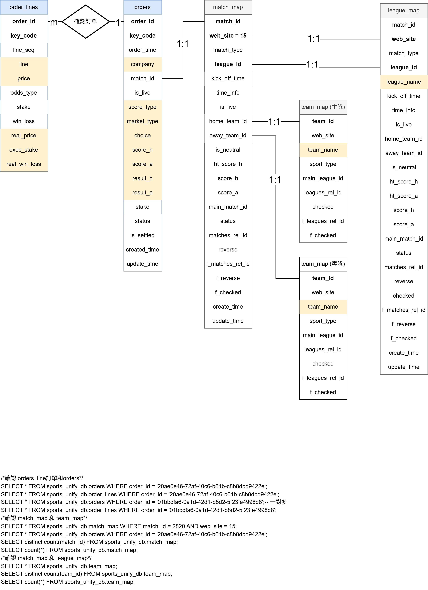

# 999 買貨db

- 目標: 找出可能的規律

> - 表目錄
> 1. [行為模式](#行為模式)
> 2. [999客戶訂單資料](#sports_unify_db)
> 3. [Order表](#orders)
> 4. [Order_lines表](#order_lines)
> 5. [map 的表](#map-的表)
> 6. [彙整的表](#彙整的表)
> 7. [PowerBI 呈現](#PowerBI-呈現)


## 行為模式

- 999的投注公司有3間公司，分別為3S、RB和292。公司做代理商買亞洲讓分盤的貨。
- 盤口/球投有多個: 一個投注者可以同時買兩隊降低風險。
- stake: 量 ， 我們會先猜對方的損益、real 是真的賺的。
- 表$\leadsto$ order(自己看一下)、order_line 賠率
- 賠率術語: odds/price,盤口(盤頭)術語: point/line
- 10-12 賽果;還貨
- market-type = choice訂單沒成立(與前者相同) = 0
- 主要玩的是 FT 讓分,  大小盤
- (x) odds_type = 4, 歐洲盤(default) 

> Database 之所以重要的原因是甚麼有助於資料管理(資料倉儲)NF1-3，針對某筆資料去更動、加入、刪除的時候，不用花太多的時間去進行全面的更新動作，即可進行同步更動其他的表格。而不是其他人所說的為了效率，那是後面所帶來的附屬優勢。 

$\blue\bigstar$   [回到表目錄](#999-買貨db)

## sports_unify_db


- 999 UK: Order 獲取的資料內容

$\blue\bigstar$   [回到表目錄](#999-買貨db)

### orders

| Column Name    | Data Type                         | Default                        | Attributes                          | Comment | Info |
|----------------|-----------------------------------|---------------------------------|--------------------------------------|---------|------|
| `order_id`     | `varchar(45)`                     |                                 | NOT NULL, PRIMARY KEY                |  訂單編號       |      |
| `key_code`     | `varchar(45)`                     |                                 | NOT NULL, PRIMARY KEY                |  顧客是誰: 999       |      |
| `order_time`   | `timestamp(6)`                    | NULL                            |                                      |    下單時間 (第一順序)  |  YYYY-MM-DD HH:MM:SS.SSSSS   |
| `company`      | `varchar(45)`                     |                                 | NOT NULL                             | 公司標籤       |3S、RB、292     |
| `match_id`     | `int(11) unsigned`                |                                 | NOT NULL                             |   比賽編號      | 應該可以對應其他關於比賽的表     |
| `is_live`      | `tinyint(1)`                      | 0                               | NOT NULL                             |    是否為滾(走)盤 0, 1     |      |
| `score_type`   | `tinyint(4)`                      |                                 | NOT NULL                            |      <font color= #0000ff>得分類型，都是一</font>      | 角球、點球、一般得分...等     |
| `market_type`  | `tinyint(4)`                      |                                 | NOT NULL                             |  市場類型       | 0: 無市場類型 <br>  1: 全場讓球盤 <br> 2: 全場大小球<br>3: 全場單雙 <br>4: 全場獨贏<br>   5: 半場讓球盤<br>   6:  半場大小球<br>   7:  半場單雙 <br>8: 半場獨贏|
| `choice`       | `tinyint(4)`                      |                                 | NOT NULL                             | 若`choice` 和 `market_type`皆為0，可以直接忽略。      |   0: None <br> 1: Home <br>  2: Away <br>  4: Over <br>  5: Under |
| `score_h`      | `tinyint(4)`                      | NULL                            |                                      |      <font color= #0000ff>當下得分</font>      | 主場(牽涉讓分，依照當下的情況)    |
| `score_a`      | `tinyint(4)`                      |  NULL                            |                                      |    <font color= #0000ff>當下得分</font>       |   客場(牽涉讓分，依照當下的情況)   |
| `result_h`     | `tinyint(4)`                      | NULL                            |                                      |    <font color= #0000ff>最後結果</font>       |      |
| `result_a`     | `tinyint(4)`                      | NULL                            |                                      | <font color= #0000ff>最後結果</font>          |      |
| `stake`        | `decimal(9,2)`                    | NULL                            |                                      |         |  買的貨量    |
| `status`       | `enum('prepare','placeOrder','stop','cancel')` |                                 | NOT NULL                             |         | 準備、下訂單、暫停?、取消     |
| `is_settled`   | `tinyint(1)`                      | 0                               | NOT NULL                             |   是否結算: 0, 1  |      |
| `created_time` | `timestamp(6)`                    | current_timestamp(6)           | NOT NULL                             |       創建 (第二順序)  |      |
| `update_time`  | `timestamp(6)`                    | NULL (ON UPDATE current_timestamp(6)) |                             |      更新 (第三順序)   |      |

<details>
  <summary><font color=red>補充的表格(點擊後展開)</font></summary>

#### Enum: `MarketType`

| Value | Enum Name  | EnumMember Value | Description (中文說明)     |
|-------|------------|------------------|-----------------------------|
| 0     | `NONE`     | "NONE"           | 無市場類型                  |
| 1     | `FT_HDP`   | "HDP"            | 全場讓球盤                  |
| 2     | `FT_OU`    | "OU"             | 全場大小球                  |
| 3     | `FT_OE`    | "OE"             | 全場單雙                    |
| 4     | `FT_1X2`   | "1X2"            | 全場獨贏（1X2）             |
| 5     | `HT_HDP`   | "HT_HDP"         | 半場讓球盤                  |
| 6     | `HT_OU`    | "HT_OU"          | 半場大小球                  |
| 7     | `HT_OE`    | "HT_OE"          | 半場單雙                    |
| 8     | `HT_1X2`   | "HT_1X2"         | 半場獨贏（1X2）             |

#### Enum: `BetType`（對應欄位：`choice`）

| Value | Enum Name | Description (中文說明) |
|-------|-----------|-------------------------|
| -1    | `CANCEL`  | 取消下注                 |
| 0     | `NONE`    | 無選擇 / 空值            |
| 1     | `HOME`    | 主隊勝                   |
| 2     | `AWAY`    | 客隊勝                   |
| 3     | `DRAW`    | 和局                     |
| 4     | `OVER`    | 大於（大球）             |
| 5     | `UNDER`   | 小於（小球）             |
| 6     | `ODD`     | 單數                     |
| 7     | `EVEN`    | 雙數                     |

</details>
<br>

**Indexes:**
- `PRIMARY KEY` (`order_id`, `key_code`)
- `index_is_settled` (`is_settled`, `choice`)

$\blue\bigstar$   [回到表目錄](#999-買貨db)

### order_lines

### Table: `order_lines`

| Column Name     | Data Type           | Default     | Attributes                  | Comment | Info |
|------------------|----------------------|--------------|------------------------------|---------|------|
| `order_id`       | `varchar(45)`        |              | NOT NULL, part of PK         |   訂單編號      |      |
| `key_code`       | `varchar(45)`        |              | NOT NULL, part of PK         | 顧客是誰: 999         |      |
| `line_seq`       | `tinyint(3) unsigned`|              | NOT NULL, part of PK         |  <font color= #0000ff>第幾個盤口(主盤口、次盤口)，1-4</font>          |      |
| `line`           | `decimal(5,2)`       | NULL         |                              |     盤口, 盤頭    |      |
| `price`          | `decimal(6,3)`       |              | NOT NULL                     | 賠率        |      |
| `odds_type`      | `tinyint(3) unsigned`| 4            | NOT NULL                     |   對應 `OddsType` Enum      | 都是4，歐洲賠率(sum小於4)。|
| `stake`          | `decimal(9,2)`       | NULL         |                              |      貨量   |      |
| `win_loss`       | `decimal(20,3)`      | NULL         |                              |   預估的輸贏      |      |
| `real_price`     | `decimal(6,3)`       | NULL         |                              |      實際成交賠率      | 若為NULL，意味著並沒有買到應有的價格(盤頭, 盤口)。      |
| `exec_stake`     | `decimal(9,2)`       | NULL         |                              |  實際成交金額            |     |
| `real_win_loss`  | `decimal(20,3)`      | NULL         |                              |  實際盈虧        |             |

**Primary Key:**
- (`order_id`, `key_code`, `line_seq`)


<details>
  <summary><font color=red>補充的表格(點擊後展開)</font></summary>

#### Enum: `OddsType`

| Value | Enum Name   | Description (賠率類型說明)     |
|-------|-------------|----------------------------------|
| 1     | `HK`        | 香港賠率（Hong Kong Odds）       |
| 2     | `MALAY`     | 馬來賠率（Malay Odds）           |
| 3     | `INDO`      | 印尼賠率（Indonesian Odds）      |
| 4     | `DECIMAL`   | 歐洲賠率（Decimal Odds）         |
| 5     | `AMERICAN`  | 美國賠率（American Odds）        |
| 6     | `FRACTIONAL`| 英式賠率（Fractional Odds）      |

</details>
<br>

$\blue\bigstar$   [回到表目錄](#999-買貨db)

### map 的表

- `team_map`, `match_map`, `league_map`為可以對應其聯盟、隊名的表格，對於目前我們來說我們只要對應 *999 UK* 所使用的隊名和聯盟就可以了，透過web_site = 15 的方式解決。注意: 這不是垂手可得的資料，這是Scott花假日的時間透過AI 去比對，以至於不同客戶(可能會因為不同的網站或文化或語言的影響)去送單來的時候，就可以很容易地知道說應該要去做怎麼樣的下單選擇。
- 最主要的表`orders`, `order_lines`

```sql
SELECT * FROM sports_unify_db.match_map WHERE matches_rel_id = 658288;-- 清楚知道對應wesite = 15 (UK 999), = 其他可能是皇冠HG, 其他的網站 
SELECT * FROM sports_unify_db.matches WHERE id = 658288;-- 我們的自己的網站
```


$\blue\bigstar$   [回到表目錄](#999-買貨db)

### 彙整的表

* 彙整公司(292, RB, 3S)在不同月分之間的貨量、損益和報酬率


```sql
-- Scott(重要) hWang, [2025/6/6 下午 04:21]
SELECT 
    DATE_FORMAT(o.order_time, '%Y-%m') AS month, -- 提取年份和月份-- '%Y-%m-%d'邏輯
    #o.choice,
    o.company,
    SUM(ol.stake) AS total_order_stake,          -- 計算每月的 order_stake 總和
    SUM(ol.win_loss) AS total_win_loss,          -- 計算每月的 win_loss 總和
    SUM(ol.win_loss) / SUM(ol.stake) AS order_win_rate          -- 計算每月的 order_stake 總和
FROM 
    orders o
JOIN 
    order_lines ol
ON 
    o.order_id = ol.order_id AND o.key_code = ol.key_code
/*WHERE
    o.market_type IN (1 , 5)        */
GROUP BY 
    DATE_FORMAT(o.order_time, '%Y-%m')          -- 按月份分組
    ,o.company
    #,o.choice
ORDER BY 
    month ASC;  
```

- 去比較主隊和客隊誰贏，每天的下單量和損益(以日期去觀察)。


```sql
SELECT 
    DATE(o.order_time) AS day,               -- 提取日期部分
    o.choice,
    #o.company,
    SUM(o.stake) AS total_order_stake,      -- 計算每天的 order_stake 總和
    SUM(ol.win_loss) AS total_win_loss      -- 計算每天的 win_loss 總和
FROM 
    orders o
JOIN 
    order_lines ol
ON 
    o.order_id = ol.order_id AND o.key_code = ol.key_code
WHERE
    o.market_type IN (1 , 5)    
GROUP BY 
    DATE(o.order_time)                      -- 按日期分組
    #,o.company
    ,o.choice
#having o.company='3s'
ORDER BY 
    day ASC;                                -- 按日期排序
```

- 以聯盟的條件下，了解整體的買貨量、損益和報酬率，以進一步觀察是否有一些端倪，例如: 某些聯盟的勝率非常的高。

- 初步的一些想法，下注量不代表贏的錢就是比較多。


- 在高收益欄位(total_real_win_loss)的情況下，需要進一步去看一下其聯盟的下注情況(等等去找)，目的是想找出平均、最高、最低的下單量(檢查是否有偏投機的行為發生僥倖，另一方面也是驗證說下注者的眼光是否相當獨到)，接著是看說其勝率(輸贏)大概如何，至於是否要進一步去分類哪公司下注(三家)，再觀察。


```sql
WITH stats_base AS (
  SELECT 
    lm.league_name,
    ol.real_win_loss,
    ol.exec_stake,
    ROW_NUMBER() OVER (PARTITION BY lm.league_name ORDER BY ol.real_win_loss) AS rn_real_win_loss,
    COUNT(*) OVER (PARTITION BY lm.league_name) AS cnt_real
  FROM orders o
  JOIN order_lines ol ON o.order_id = ol.order_id AND o.key_code = ol.key_code
  JOIN match_map m ON CAST(o.match_id AS CHAR) = m.match_id AND m.web_site = 15
  JOIN league_map lm ON m.league_id = lm.league_id AND m.web_site = lm.web_site
  WHERE ol.exec_stake IS NOT NULL
),

quartiles AS (
  SELECT 
    league_name,
    AVG(CASE WHEN rn_real_win_loss IN (FLOOR((cnt_real + 1) / 2), CEIL((cnt_real + 1) / 2)) THEN real_win_loss END) AS median
  FROM stats_base
  GROUP BY league_name
),

exec_stats_base AS (
  SELECT 
    lm.league_name,
    ol.exec_stake,
    ROW_NUMBER() OVER (PARTITION BY lm.league_name ORDER BY ol.exec_stake) AS rn_exec,
    COUNT(*) OVER (PARTITION BY lm.league_name) AS cnt_exec
  FROM orders o
  JOIN order_lines ol ON o.order_id = ol.order_id AND o.key_code = ol.key_code
  JOIN match_map m ON CAST(o.match_id AS CHAR) = m.match_id AND m.web_site = 15
  JOIN league_map lm ON m.league_id = lm.league_id AND m.web_site = lm.web_site
  WHERE ol.exec_stake IS NOT NULL
),

exec_stake_median AS (
  SELECT 
    league_name,
    AVG(CASE 
          WHEN rn_exec IN (FLOOR((cnt_exec + 1) / 2), CEIL((cnt_exec + 1) / 2))
          THEN exec_stake 
        END) AS exec_stake_median
  FROM exec_stats_base
  GROUP BY league_name
)

SELECT 
  lm.league_name,
  COUNT(CASE WHEN ol.real_win_loss > 0 THEN 1 END) AS win_count,
  COUNT(CASE WHEN ol.real_win_loss = 0 THEN 1 END) AS tie_count,
  COUNT(CASE WHEN ol.real_win_loss < 0 THEN 1 END) AS loss_count,
  ROUND(COUNT(CASE WHEN ol.real_win_loss > 0 THEN 1 END) / COUNT(*), 2) AS win_ratio,

  -- 所有下注統計（不只贏家）
  SUM(ol.exec_stake) AS exec_stake_total,
  ROUND(AVG(ol.exec_stake), 2) AS exec_stake_avg,
  ROUND(em.exec_stake_median, 2) AS exec_stake_median,

  -- 輸贏相關統計
  ROUND(AVG(ol.real_win_loss), 2) AS real_win_loss_avg,
  ROUND(q.median, 2) AS real_win_loss_median,
  MIN(ol.real_win_loss) AS real_win_loss_min,
  MAX(ol.real_win_loss) AS real_win_loss_max,
  SUM(ol.real_win_loss) AS real_win_loss_total

FROM 
  orders o
JOIN 
  order_lines ol ON o.order_id = ol.order_id AND o.key_code = ol.key_code
JOIN 
  match_map m ON CAST(o.match_id AS CHAR) = m.match_id AND m.web_site = 15
JOIN 
  league_map lm ON m.league_id = lm.league_id AND m.web_site = lm.web_site
JOIN 
  quartiles q ON lm.league_name = q.league_name
LEFT JOIN 
  exec_stake_median em ON lm.league_name = em.league_name

WHERE 
  ol.exec_stake IS NOT NULL

GROUP BY 
  lm.league_name, q.median, em.exec_stake_median

HAVING 
  COUNT(CASE WHEN ol.real_win_loss > 0 THEN 1 END) > 10
  AND ROUND(COUNT(CASE WHEN ol.real_win_loss > 0 THEN 1 END) / COUNT(*), 2) > 0.7

ORDER BY 
  real_win_loss_max DESC, win_ratio DESC;
```


```sql
SELECT 
    #DATE_FORMAT(o.order_time, '%Y-%m') AS order_month,
    lm.league_name,
    SUM(ol.exec_stake) AS total_exec_stake,
    SUM(ol.real_win_loss) AS total_real_win_loss,
    SUM(ol.real_win_loss) / SUM(ol.exec_stake) AS total_real_win_loss_rate
  FROM 
    orders o
  JOIN 
    order_lines ol 
    ON o.order_id = ol.order_id 
    AND o.key_code = ol.key_code
-- match_id 配對出對應的聯盟
  JOIN 
    match_map m
    ON CAST(o.match_id AS CHAR) = m.match_id
    AND m.web_site = 15 -- `web_site`是甚麼
  JOIN 
    league_map lm
    ON m.league_id = lm.league_id
    AND m.web_site = lm.web_site -- `web_site`是甚麼

-- 看不出下面合併的意義: sol 單純未來如果需要用到的時候球隊的時候
  JOIN 
    team_map th -- 主隊
    ON m.home_team_id = th.team_id 
    AND m.web_site = th.web_site
  JOIN 
    team_map ta -- 客隊
    ON m.away_team_id = ta.team_id
    AND m.web_site = ta.web_site

  WHERE ol.exec_stake IS NOT NULL    -- AND o.choice != 0
  GROUP BY 
    lm.league_name -- 排序聯盟
  ORDER BY 
    total_exec_stake DESC, total_real_win_loss_rate DESC;
```

<details>
  <summary><font color=red>測試(點擊後展開)</font></summary>

```sql
SELECT 
    lm.league_name,
    COUNT(CASE WHEN ol.real_win_loss > 0 THEN 1 END) AS win_count,
    COUNT(CASE WHEN ol.real_win_loss < 0 THEN 1 END) AS loss_count,
    COUNT(*) AS total_bets
FROM 
    orders o
JOIN 
    order_lines ol 
    ON o.order_id = ol.order_id 
    AND o.key_code = ol.key_code
JOIN 
    match_map m
    ON CAST(o.match_id AS CHAR) = m.match_id
    AND m.web_site = 15
JOIN 
    league_map lm
    ON m.league_id = lm.league_id
    AND m.web_site = lm.web_site
WHERE 
    ol.exec_stake IS NOT NULL
GROUP BY 
    lm.league_name
ORDER BY 
    win_count DESC, loss_count DESC;
```

</details>


- 想像說一個情境
    - 找出勝率高/投注高/獲利高: 自行調整成勝率在0.7以上去觀察、檢查exec_stake、報酬
    - 不是僥倖(次數少): 設定投注贏的次數在10次以上
    - 維持一定額度: 看是否自訂exec_stake
    - ~~變異程度低，固定額度獲利模式(未必是重要)~~


<details>
  <summary><font color=red></font></summary>

```sql
-- 建立第一層資料集：統計所有聯盟的每一筆資料的輸贏金額與下注金額，並計算中位數所需的排名與資料數量
WITH stats_base AS (
  SELECT 
    lm.league_name,                                         -- 聯盟名稱
    ol.real_win_loss,                                       -- 每筆實際輸贏金額
    ol.exec_stake,                                          -- 每筆實際下注金額
    ROW_NUMBER() OVER (PARTITION BY lm.league_name 
                       ORDER BY ol.real_win_loss) AS rn_real_win_loss, -- 每個聯盟內輸贏金額由小到大排序後的排名
    COUNT(*) OVER (PARTITION BY lm.league_name) AS cnt_real             -- 每個聯盟的總資料筆數
  FROM orders o
  JOIN order_lines ol ON o.order_id = ol.order_id AND o.key_code = ol.key_code
  JOIN match_map m ON CAST(o.match_id AS CHAR) = m.match_id AND m.web_site = 15
  JOIN league_map lm ON m.league_id = lm.league_id AND m.web_site = lm.web_site
  WHERE ol.exec_stake IS NOT NULL
),

-- 第二層資料集：從上層 stats_base 中取每個聯盟的中位數 real_win_loss
quartiles AS (
  SELECT 
    league_name,
    AVG(CASE 
          WHEN rn_real_win_loss IN (FLOOR((cnt_real + 1) / 2), CEIL((cnt_real + 1) / 2))
          THEN real_win_loss 
        END) AS median                                   -- 計算 real_win_loss 的中位數
  FROM stats_base
  GROUP BY league_name
),

-- 第三層資料集：只統計「有贏錢」的下注，用來求贏家下注金額的中位數
win_stats_base AS (
  SELECT 
    lm.league_name,
    ol.exec_stake,
    ROW_NUMBER() OVER (PARTITION BY lm.league_name 
                       ORDER BY ol.exec_stake) AS rn_exec,  -- 贏家下注金額由小到大排序的排名
    COUNT(*) OVER (PARTITION BY lm.league_name) AS cnt_exec -- 每個聯盟贏家筆數
  FROM orders o
  JOIN order_lines ol ON o.order_id = ol.order_id AND o.key_code = ol.key_code
  JOIN match_map m ON CAST(o.match_id AS CHAR) = m.match_id AND m.web_site = 15
  JOIN league_map lm ON m.league_id = lm.league_id AND m.web_site = lm.web_site
  WHERE ol.exec_stake IS NOT NULL AND ol.real_win_loss > 0
),

-- 第四層：從 win_stats_base 中取得贏家下注金額中位數
win_stake_median AS (
  SELECT 
    league_name,
    AVG(CASE 
          WHEN rn_exec IN (FLOOR((cnt_exec + 1) / 2), CEIL((cnt_exec + 1) / 2))
          THEN exec_stake 
        END) AS win_exec_stake_median
  FROM win_stats_base
  GROUP BY league_name
)

-- 最終查詢：彙總每個聯盟的統計數據
SELECT 
  lm.league_name,
  COUNT(CASE WHEN ol.real_win_loss > 0 THEN 1 END) AS win_count,   -- 贏的次數
  COUNT(CASE WHEN ol.real_win_loss = 0 THEN 1 END) AS tie_count,   -- 平手次數
  COUNT(CASE WHEN ol.real_win_loss < 0 THEN 1 END) AS loss_count,  -- 輸的次數

  ROUND(COUNT(CASE WHEN ol.real_win_loss > 0 THEN 1 END) / COUNT(*), 2) AS win_ratio, -- 勝率

  SUM(CASE WHEN ol.real_win_loss > 0 THEN ol.exec_stake ELSE 0 END) AS win_exec_stake_total, -- 贏的下注總金額
  ROUND(AVG(CASE WHEN ol.real_win_loss > 0 THEN ol.exec_stake END), 2) AS win_exec_stake_avg, -- 贏的下注平均
  ROUND(wm.win_exec_stake_median, 2) AS win_exec_stake_median, -- 贏的下注中位數

  ROUND(AVG(ol.real_win_loss), 2) AS real_win_loss_avg,         -- 所有輸贏的平均值
  ROUND(q.median, 2) AS real_win_loss_median,                   -- 所有輸贏的中位數
  MIN(ol.real_win_loss) AS real_win_loss_min,                   -- 最小輸贏金額
  MAX(ol.real_win_loss) AS real_win_loss_max,                   -- 最大輸贏金額
  SUM(ol.real_win_loss) AS real_win_loss_total                  -- 總輸贏金額
  -- ROUND(q.q1, 2) AS real_win_loss_q1,
  -- ROUND(q.q3, 2) AS real_win_loss_q3
  
FROM 
  orders o
JOIN 
  order_lines ol ON o.order_id = ol.order_id AND o.key_code = ol.key_code
JOIN 
  match_map m ON CAST(o.match_id AS CHAR) = m.match_id AND m.web_site = 15
JOIN 
  league_map lm ON m.league_id = lm.league_id AND m.web_site = lm.web_site
  
JOIN 
  quartiles q ON lm.league_name = q.league_name
LEFT JOIN 
  win_stake_median wm ON lm.league_name = wm.league_name
WHERE 
  ol.exec_stake IS NOT NULL
GROUP BY 
  lm.league_name, q.median, wm.win_exec_stake_median
  HAVING 
  COUNT(CASE WHEN ol.real_win_loss > 0 THEN 1 END) > 5 AND
  ROUND(COUNT(CASE WHEN ol.real_win_loss > 0 THEN 1 END) / COUNT(*), 2) > 0.7
ORDER BY 
  real_win_loss_max DESC, win_ratio DESC;
```
</details>

$\blue\bigstar$   [回到表目錄](#999-買貨db)

## PowerBI 呈現




<details>
  <summary><font color=red></font></summary>

```sql
/*確認 orders_line訂單和orders*/
SELECT * FROM sports_unify_db.orders WHERE order_id = '20ae0e46-72af-40c6-b61b-c8b8dbd9422e';
SELECT * FROM sports_unify_db.order_lines WHERE order_id = '20ae0e46-72af-40c6-b61b-c8b8dbd9422e';
SELECT * FROM sports_unify_db.orders WHERE order_id = '01bbdfa6-0a1d-42d1-b8d2-5f23fe4998d8';-- 一對多
SELECT * FROM sports_unify_db.order_lines WHERE order_id = '01bbdfa6-0a1d-42d1-b8d2-5f23fe4998d8';
/*確認 match_map 和 team_map*/
SELECT * FROM sports_unify_db.match_map WHERE match_id = 2820 AND web_site = 15;
SELECT * FROM sports_unify_db.orders WHERE order_id = '20ae0e46-72af-40c6-b61b-c8b8dbd9422e';
SELECT distinct count(match_id) FROM sports_unify_db.match_map;
SELECT count(*) FROM sports_unify_db.match_map;
/*確認 match_map 和 league_map*/
SELECT * FROM sports_unify_db.team_map;
SELECT distinct count(team_id) FROM sports_unify_db.team_map;
SELECT count(*) FROM sports_unify_db.team_map;
```

</details>

- 未來的目標: 想未來的資料庫的目的走向，要走向**OLAP即時分析**、風險控管(異常下注)和**資料倉儲**等。insightflow_db

- create database concept(for denormalize):
  - colnames: 這裡指的維度指的是說在不同的角度去分析事件的全貌，至於原因是甚麼是因為當你的維度劃分的太細緻的時候會導致你無法看出數據的一些特徵。
  - e.g. 當你維度從訂單彙總成日、月和年等，我們資料的範圍就可以進一步去縮小，更便於我們去看初一些端倪。
  - 注意: 維度不單單指的是欄位而已，更具體的說是指精細程度，例如: 去除訂單(最小單位)的資訊，我們去了解說在年、季、月和日的加總(groupby, summarise)，去分析公司、不同玩法、不同的盤口...等的角度，以至於去了解到一些規律的情況。

- 目前的系統是建立在'10.11.8-MariaDB-0ubuntu0.24.04.1'

| 欄位名稱           | 資料型別                           | 主鍵;NULL | 說明                                                  | 用途|
| -------------- | ------------------------------ | -- | --------------------------------------------------- |--------|
| ~~`order_id`~~     | `varchar(45)`                  | ✅  | 訂單編號                                                | 分析用不到，但有助於追追溯|
| ~~`key_code`~~   | `varchar(45)`                  | ✅  | 身分辨別                                                |分析用不到，但有助於追追溯|
| ~~`match_id`~~     | `int unsigned`                 |    | 比賽編號                                                |分析用不到，但有助於追追溯|
| `match_time`   | `datetime`                     |    | 比賽開始時間                                                |<font color=red>重要的分類依據</font><br>轉換成年、季、月和日等不同維度下去切分(目前只有2025)。<br>年: order_year<br>季: order_quarter<br>月: order_month<br>周: order_week<br>日: order_day|
| `company`      | `varchar(45)`                  |    | 公司類別                                                |<font color=red>重要的分類依據</font>|
| `league_name`  | `varchar(45)`                  |    | 聯盟名稱                                                |<font color=red>重要的分類依據</font>|
| `home_name`    | `varchar(45)`                  |    | 主場隊伍名稱                                              |<font color=red>重要的分類依據</font>|
| `away_name`    | `varchar(45)`                  |    | 客場隊伍名稱                                              |<font color=red>重要的分類依據</font>|
| `is_live`      | `tinyint(3) unsigned zerofill` |    | 是否為滾(走)盤（0=死盤，1=走盤）                                 |分析可能用不到，未來不一定|
| `score_type`   | `varchar(45)`                  | NULL   | 得分類型，目前固定為 `1`，未來可能加入角球、點球等                         |分析可能用不到，未來不一定|
| `market_type`  | `tinyint`                      | NULL   | 玩法類型<br>0: 無<br>1: 全場讓球盤<br>2: 全場大小球                |<font color=red>重要的分析依據</font>|
| `choice`       | `tinyint`                      | NULL   | 下注標的<br>0: 未下注/取消<br>1: 主場<br>2: 客場<br>4: 大<br>5: 小 |<font color=red>重要的分析依據</font>|
| `score_h`      | `tinyint`                      | NULL   | 主場得分（可能含讓分）                                         |分析可能用不到，目前想不太到意圖|
| `score_a`      | `tinyint`                      | NULL   | 客場得分（可能含讓分）                                         |分析可能用不到，目前想不太到意圖|
| `result_h`     | `tinyint`                      | NULL   | 主場結果                                                |分析可能用不到，目前想不太到意圖|
| `result_a`     | `tinyint`                      |  NULL  | 客場結果                                                |分析可能用不到，目前想不太到意圖|
| `line`         | `decimal(5,2)`                 |  NULL  | 盤口數值                                                |分析可能用不到，目前想不太到意圖|
| `real_price`&`price`        | `decimal(6,3)`                 | NULL   | 賠率                                                  |分析可能用不到，目前想不太到意圖|
| `exec_stake`        | `decimal(9,2)`                 | NULL   | 買貨量（下注金額）                                           |<font color=red>重要的分析依據</font>|
| `win_loss`     | `decimal(10,3)`                |  NULL  | 輸贏金額                                                |最重要的分析依據，進一步轉換成賠/走盤/賺等是否獲利欄位|
| ~~`status`~~       |   `enum(...)`                  |    | 下單狀態<br>如: prepare/placeOrder/stop/cancel           |下條件排除|
| ~~`is_settled`~~   | `tinyint`                    |    | 是否結算：0, 1                 |分析可能用不到，目前想不太到意圖|
| ~~`order_time`~~   | `timestamp(6)`                 |  NULL  | 下單時間                                                |轉換成比賽進行到第幾分鐘，order_minute_diff。|
| ~~`created_time`~~ | `timestamp(6)`                 |    | 建立時間                                                |分析可能用不到，目前想不太到意圖|
| ~~`update_time`~~  | `timestamp(6)`                 |    | 更新時間                                                |分析可能用不到，目前想不太到意圖|

<details>
  <summary>SQL</summary>

```sql

DELIMITER $$
CREATE PROCEDURE export_to_new_table()
BEGIN
  -- 如果表已存在就先刪除
  DROP TABLE IF EXISTS sports_unify_db.ana_table;

  -- 建立新表並將查詢結果寫入
  CREATE TABLE sports_unify_db.ana_table AS
-- 放select from where
END$$
DELIMITER ;

SELECT 
	-- origin
	company,
	o.is_live,
	score_type,
	market_type,
	choice,
	o.score_h,
	o.score_a,
	o.result_h,
	o.result_a,
	line,
	ol.price,
	m.web_site,
	lm.league_name,
	th.team_name as home_team,
	ta.team_name as away_team,
--     o.`status`,
-- update
	IFNULL(real_price, 0) AS real_price,
	IFNULL(exec_stake, 0) AS exec_stake,
	IFNULL(real_win_loss,0 ) AS real_win_loss,
    
-- add
	--IF(market_type IN(1,5), CASE WHEN line > 0 THEN 1 WHEN line < 0 THEN 2 ELSE 3 END, 0) AS line_type,
  IF(market_type IN(1,5), CASE WHEN (o.choice = 2 AND ol.line < 0) OR (o.choice = 1 AND ol.line > 0) THEN 1 WHEN (o.choice = 1 AND ol.line < 0) OR (o.choice = 2 AND ol.line > 0) THEN 2 ELSE 3 END, 0) AS line_type,
	-- time
	TIMESTAMPDIFF(MINUTE, m.kick_off_time, o.order_time) AS order_minute_diff,
	YEAR(o.order_time) AS order_year,
	QUARTER(o.order_time) AS order_quarter,
	MONTH(o.order_time) AS order_month,
	WEEK(o.order_time, 1) AS order_week,       -- mode=1 表示週一為每週第一天
	DAY(o.order_time) AS order_day,
	DATE(o.order_time) AS order_date,
    -- 自訂週期（每3/4/5天一週期）
	FLOOR(DATEDIFF(o.order_time, '2024-01-01') / 3) + 1 AS cycle_3day,
	FLOOR(DATEDIFF(o.order_time, '2024-01-01') / 4) + 1 AS cycle_4day,
	FLOOR(DATEDIFF(o.order_time, '2024-01-01') / 5) + 1 AS cycle_5day,
    
	-- 勝負
	CASE 
  WHEN real_win_loss IS NULL THEN 'unknown'
  WHEN real_win_loss > 0 THEN 'win'
  WHEN real_win_loss = 0 THEN 'tie'
  ELSE 'loss'
END AS result_type,
	IF(real_win_loss>0,1,0) AS win_count,
	IF(real_win_loss=0,1,0) AS tie_count,
	IF(real_win_loss<0,1,0) AS loss_count
    
	FROM orders o
	JOIN order_lines ol 
	ON o.order_id = ol.order_id AND o.key_code = ol.key_code
	
    JOIN match_map m
	ON CAST(o.match_id AS CHAR) = m.match_id
	JOIN league_map lm
	ON m.league_id = lm.league_id
	AND m.web_site = lm.web_site
	JOIN team_map th
	ON m.home_team_id = th.team_id
	JOIN team_map ta
	ON m.away_team_id = ta.team_id
	WHERE m.web_site = 15 AND market_type != 0;


-- 其他 check
SELECT 
    o.order_id,
    o.key_code,
    o.order_time,
    m.kick_off_time,
    -- 其他欄位…
    lm.league_name,
    th.team_name AS home_team,
    ta.team_name AS away_team
FROM orders o
JOIN order_lines ol ON o.order_id = ol.order_id AND o.key_code = ol.key_code
JOIN match_map   m  ON o.match_id = m.match_id
JOIN league_map  lm ON m.league_id = lm.league_id AND m.web_site = lm.web_site
JOIN team_map    th ON m.home_team_id = th.team_id
JOIN team_map    ta ON m.away_team_id = ta.team_id
WHERE m.web_site = 15
  AND o.market_type != 0
  AND (o.order_time IS NULL OR m.kick_off_time IS NULL);   -- 關鍵：找出任何一欄為 NULL
```

```sql
-- create Procedures 建立新的的表
call ana_beta();
```

</details>
🎯 預期達到的成果

✅ 以公司的角度出發 (防止有發行商去偷下注的行為)

- (假想) 在不同維度（年、季、月、日）下，可觀察到不同公司的策略變化，例如：

  - 輪流輸

  - 買貨量明顯減少

  - 購買賠率特別高（主觀判斷）

🔴 關鍵定義：檢查三家公司在某段週期下的損益是否皆為正值，可能提前察覺某公司是「專門輸」的。

- (假想) 查驗公司是否特別偏好下注某些聯盟或球隊。

- (假想) 區分「賺/走盤/賠」的時間分布，若在某些區間有明顯勝負差異，可能可用來識別策略。

✅ 排除公司架構下 (聯盟或隊伍較容易判別)
- (假想) 若三家公司皆為正收益，則可觀察：

  - 是否有聯盟或球隊下的比賽，下注成功率顯著較高。

  - 若某公司為長期虧損或不穩定，則可能可作為反指標使用。

✅ 排除公司架構下 (玩法策略角度)

- (假想) 若三家公司獲利皆為正，可觀察：

  - 某些玩法（如讓分、大小）是否較易預測/獲利？

  - 是否普遍來說主隊較容易贏（例如主場優勢等）？

❌ 排除方向 (歷史資料勝率分析困難)
- 雖然想透過球隊勝率作為客觀指標，但由於投注非全場涵蓋，且牽涉讓分問題，資料不足導致無法實行。

📊 EDA 發現
- 公司整體損益表現
期間：2024/2/17 ～ 2024/6/10

- 三家公司損益皆為正：
3S > 292 > RB

- 不同玩法類型分析 (market_type / choice)
  - 讓分盤 HDP（line_type=3: 主讓分 / 2: 無讓分 / 1: 客讓分） 三家皆為正收益，3S在下注客隊時獲利明顯領先。

  - 詳細情況：
    - 有讓分（主/客）：僅 3S 獲利穩定，RB 與 292 無明顯獲利。
    - 無讓分：僅 292 有獲利，RB 與 3S 為虧損。

  - 大小盤 O/U: 整體獲利下降明顯，3S 損失最為嚴重。
  - 大小盤進一步分析（下注「大」或「小」）
    - 3S 並非全盤皆輸： 賭「大」損失大於賭「小」的獲利。
- 買貨量觀察: 3S 買貨量遠大於其他兩家，2024年5月的買貨量明顯高出其他月份 → 值得進一步探究其原因。


- 單純就以日期來看，我發現RB和3S的損益起伏是大致相同，~~至於下注策略需要進一步去查證(下注的聯賽有很大不同)~~，從週為一個單位來看更為明顯(備註: 以不同星期為基準，差異性不大，對於時間來說就只是平移/位移的概念，不影響結論)。292的損益起伏不會太大，相對於RB和3S的獲利軌跡有明顯的差異。

- 在客隊讓分的情況下，3S公司在下注獲利的成功率是遠高於其他隊伍。
- 3S在下注HDP客隊: 在義大利A組、西班牙和英超等是比較準的(以不損失的立場來看)。
- 3S下大小盤損失情況最為嚴重，尤其在是在義大利A組、其次是德國一級聯賽。
- 損益時間軌跡觀察，以日期觀察：
  - RB 與 3S 的損益起伏軌跡類似
  - 292波動較小，與其他兩者差異明顯
  以週為單位觀察更明顯（平移性無影響）
- 3S 在下注「HDP 客隊」時獲利成功率高於其他公司
  - 對應聯盟：義大利A組、西班牙聯賽、英超聯賽
- 3S 下「大小盤」損失最嚴重，義大利A組損失最重，其次為德國一級聯賽

$\blue\bigstar$   [回到表目錄](#999-買貨db)

#### 其他角度出發

- 以訂貨量為出發點，猜錯為無法容忍、猜中為其次目的。

分別以天、3天、4天、5天和週等去了解大致的週期變化，可以發現以一天為單位波動太激烈，無法了解其失誤率落的範圍，主觀認為以4天為週期的設定為最佳，因為到第五、七天變化程度就沒什麼改變。此外，我透過兩兩比較的方式，發現失誤率最小的是3S，其次依序為292，最後是RB。從趨勢線的角度來看，RB和3S的失誤率有下降的趨勢，而292有些微上升趨勢。


- 若忽略公司的情況下，總體來說趨勢線是向下。


$\blue\bigstar$   [回到表目錄](#999-買貨db)

- 讓分盤
  - 當客隊讓分的情況下，3S雖然猜對機率相較兩家沒有比較高，但是其失誤率是低非常多的。
  - 當主隊讓分的情況下，三家都沒有很好地猜中最後的結果，比較特別的是3S仍然是失誤率最低的。
  - 當沒有讓分的情況下，三家策略都會轉變成比較保守，大都以走盤收場。另一方面，也或許是無讓分局的局面本身就較難猜中，相較於前兩種情況其猜中的機率下降10到20%之多。
  - 以整體策略來說，3S所呈現出來的結果，失誤率是相較低為25%，而走盤占比也是最多的為40%，相較其他兩家較為保守。其背後的原因猜測3S投注的賽事較大，所投注的金額可能較高，因此策略較為保守。所觀察到前投注次數高的賽事有Germany 2. Bundesliga, France Ligue 1, Spain La Liga, England Premier Lge等等。至於292和RB是中到小的聯賽，例如:England Premier League 2, Bulgaria 1st Division, Portugal Segunda Liga, Germany 3.Liga等等
- 大小盤: 無論是哪一家公司都不太擅長猜測。
- 為了比較三家不同公司的下注策略差異，本文採用三種量化指標，分別從「下注有無行為」與「下注量級」兩個層面進行兩兩比較，進而辨識公司策略的相似性，並為後續公司分類與行為模式建模提供依據。


  - Jaccard Index（下注聯盟的交集程度）
> 目的： 衡量公司投注聯盟的**「參與情況相似度」**。
> 說明： A、B 為兩家公司投注過的聯盟集合。僅考慮「是否有投注」，不考慮投注次數或金額。
> 應用情境： 適合判斷兩家公司關注的是不是同一群聯盟（不管投注量多少）。特別適合有大小聯盟分布不均情況。
  - Cosine Similarity（下注量級的方向相似度）
> 目的： 衡量公司投注策略在不同聯盟上的**「下注量分布相似度」**。
> 說明： 每家公司對每個聯盟投注的次數或金額視為向量元素。衡量的是下注量級的方向是否一致，與總投注量無關。
> 應用情境： 用來判斷是否投注量的重心放在同樣的聯盟。

-  交集聯盟數（Joint Sponsorship Count）
> 目的： 計算兩家公司實際同時投注的聯盟數，提供量化「共同目標」的次數。
> 說明： 直接計算兩家公司投注的聯盟重疊數量。可與 Jaccard 一起呈現，以補充具體的重疊規模。即使總投注量不同，若投注比例相似也會得到高相似度。

- 時間分析設計：
  - 可加入切片器（Slicer）讓使用者依照時間區段（年、季、月、週）切換觀察公司策略的變化。
  - 搭配時間變數分析指標變化趨勢，如是否在某季度共同投注行為升高。

- 行為模式建議：
  - 若兩家公司在上述指標上皆表現出高相似性，則可視為同一類型策略（例如主攻主流大聯盟）。
  - 相異指標組合（如 Jaccard 高但 cosine 低）可進一步探討策略差異性（例如關注同樣聯盟但投注資源分配不同）。

| 指標名稱              | 比較面向   | 是否考慮投注量 | 用途            |
| ----------------- | ------ | ------- | ------------- |
| Jaccard Index     | 投注聯盟範圍 | 否       | 評估投注目標相似度（是否） |
| Cosine Similarity | 投注量分布  | 是       | 評估投注策略量級（多少）  |
| 聯盟交集數             | 實際重疊數  | 否       | 提供重疊具體數字支持    |


#### 足球時間的補充

| 項目         | 說明                                             |
| ---------- | ---------------------------------------------- |
| **時間長度**   | 總共 30 分鐘，分成上下半場各 15 分鐘。                        |
| **中場休息**   | 加時上、下半場之間通常有短暫休息（1\~2 分鐘）。                     |
| **是否再平手？** | 若 120 分鐘後仍然平手，則進入 **點球大戰（Penalty Shoot-out）**。 |
| **是否一定有？** | 只有在**需要分出勝負**的比賽才會有（例如淘汰賽）。聯賽平手則直接結束比賽。        |

| 階段    | 時間             | 是否有勝負                  |
| ----- | -------------- | ---------------------- |
| 正規時間  | 90 分鐘          | 若平手：某些比賽結束（如聯賽），某些進入加時 |
| 加時上半場 | 15 分鐘（91–105）  | 若仍平手，繼續加時下半場           |
| 加時下半場 | 15 分鐘（106–120） | 若仍平手，進入點球大戰            |

- 「補時」與「加時」在足球比賽中是兩個完全不同的概念

| 項目         | 補時（Injury Time / Stoppage Time） | 加時（Extra Time）            |
| ---------- | ------------------------------- | ------------------------- |
| **何時發生**   | 每個半場結束前（上、下半場各一次）               | 正規90分鐘平手時才有               |
| **目的**     | 補回比賽中斷時間（換人、犯規、傷停）              | 決出勝負，避免平手                 |
| **時間長度**   | 通常1～6分鐘不等                       | 固定30分鐘（15分鐘x2）            |
| **出現條件**   | 每場比賽都有（上下半場）                    | 只有淘汰賽平手時才有                |
| **是否必定出現** | ✅ 一定會有（上、下半場）                   | ❌ 只有需要勝負的比賽才出現            |
| **顯示方式**   | 顯示為 45+3'、90+5' 等               | 顯示為 105'、120' 等（或加時上、下半場） |
| **是否可進球**  | ✅ 可以進球                          | ✅ 可以進球                    |

✅ 補時（Injury Time）
又稱「傷停補時」、「Stoppage Time」。

由主裁判判定（根據比賽中斷的總時長決定）。

例子：

上半場結束前顯示：45+2'

下半場結束前顯示：90+4'

✅ 加時（Extra Time）
是延長賽的一部分，發生在 90 分鐘之後。

只用於必須分出勝負的情況，例如：

世界盃淘汰賽、歐冠決賽、盃賽準決賽等。

結束後還平手，進入點球大戰（Penalty Shootout）。

- 補時是因比賽過程中斷而延長的時間，每場比賽都會有。
- 加時是比賽打平時再打的延長賽，只有淘汰賽才會出現。

#### 鍵值的補充

>PK：primary key 主鍵
NN：not null 非空值
UQ：unique 唯一索引
BIN：binary 二進位制的資料(比text更大)
> | 資料類型          | 建議使用                           |
> | ------------- | ------------------------------ |
> | 圖片、影片、聲音檔     | `BLOB`（或 `LONGBLOB`）           |
> | 雜湊值（如 SHA256） | `BINARY(32)`                   |
> | Token、UUID    | `VARBINARY(36)` 或 `BINARY(16)` |
> | 純文字內容（例如留言）   | `TEXT` 或 `VARCHAR`             |
>UN：unsigned 無符號(非負數) `UNSIGNED 是資料欄位的一個屬性，用於整數類型（如 INT, TINYINT, BIGINT 等），代表這個欄位「不接受負數」，也就是只能儲存 0 或正整數，排除負數、數值範圍加倍正向空間、用在 ID、數量、金額等場景。`

> ZF：zero fill 填充0，例如字段的內容是1 int(4), 則內容顯示0001
> AI：auto increment 自行增加
G: Generated Column mysql5.7 新特性：這一列由其他列計算而得
> | 場景      | 欄位說明                                                   |
> | ------- | ------------------------------------------------------ |
> | 自動計算總額  | `price * quantity`                                     |
> | 資料清理格式化 | 從 `email` 取 domain，如 `SUBSTRING_INDEX(email, '@', -1)` |
> | 狀態判定欄位  | 例如：`is_high_risk GENERATED ALWAYS AS (amount > 1000)`  |
> | 年齡計算欄位  | `birth_date` → `YEAR(CURDATE()) - YEAR(birth_date)`    |

#### 非正規畫的補充

- 正規化（Normalization）：將資料拆分成多個表，避免重複與資料異常，強調資料一致性與更新效率。 ACID
  - 原子性（Atomicity）：一個事務（transaction）中的所有操作，或者全部完成，或者全部不完成，不會結束在中間某個環節。事務在執行過程中發生錯誤，會被回滾（Rollback）到事務開始前的狀態，就像這個事務從來沒有執行過一樣。即，事務不可分割、不可約簡。
  - 一致性（Consistency）：在事務開始之前和事務結束以後，資料庫的完整性沒有被破壞。這表示寫入的資料必須完全符合所有的預設約束、觸發器、級聯回滾等。
  - 事務隔離（Isolation）：資料庫允許多個並發事務同時對其數據進行讀寫和修改的能力，隔離性可以防止多個事務並發執行時由於交叉執行而導致數據的不一致。事務隔離分為不同級別，包括未提交讀（Read uncommitted）、提交讀（read committed）、可重複讀（repeatable read）和串行化（Serializable）。
  - 持久性（Durability）：事務處理結束後，對數據的修改就是永久的，即便系統故障也不會丟失。
- 反正規劃：將資料表合併或嵌套，讓查詢更快速，特別是在讀取密集型的資料倉儲中很常見。
  - 資料倉儲中的查詢常跨多表連接（JOIN），為了減少 JOIN 效能瓶頸，會採用反正規劃。

在資料倉儲中，反正規劃常出現在以下兩個模型：

1. 星型模型（Star Schema）
> 事實表（Fact Table）：儲存交易紀錄，如銷售金額、數量等。
維度表（Dimension Table）：儲存描述性資訊，如產品、客戶、時間。
維度表通常反正規劃，讓查詢時不需再 JOIN 多層表格。

- 範例：
客戶維度表（Customer Dimension）會將「城市」、「地區」、「國家」合在一張表，而不是拆成多個正規化表。

2. 雪花模型（Snowflake Schema）
> 維度表經正規化，拆成多張表。
結構清楚但查詢複雜、效能較低。
若查詢效能為優先考量，會轉為星型模型，也就是進行反正規劃。

| 技術                       | 說明                           | 目的         |
| ------------------------ | ---------------------------- | ---------- |
| 合併欄位                     | 將相關資訊存在同一表，如「地址」包含城市、街道、郵遞區號 | 減少 JOIN 次數 |
| 加入冗餘欄位                   | 在事實表中加上維度的常用欄位，如客戶名稱         | 提升查詢速度     |
| 計算欄位                     | 加入預先計算的值，如總價 = 數量 x 價格       | 減少即時計算     |
| 物化檢視表（Materialized View） | 將複雜查詢的結果存成表                  | 快速存取聚合資料   |

| 優點             | 缺點              |
| -------------- | --------------- |
| 提升查詢效能，特別是報表查詢 | 資料重複、佔用空間       |
| 減少 JOIN 操作     | 資料一致性風險高（更新不易）  |
| 符合 OLAP 分析模式   | ETL 較複雜，需處理資料同步 |

- 反正規劃是資料倉儲中提高查詢效率的常用策略。
- 在星型架構中廣泛應用，讓 OLAP 查詢更快。 [link](https://cloud.tencent.com/developer/article/2078753)
- 雖然犧牲了一些資料一致性與空間，但能大幅提升資料分析效能。


<details>
  <summary><font color=red>補充的表格(點擊後展開)</font></summary>

| 模型                          | 特徵               | 使用情境          |
| --------------------------- | ---------------- | ------------- |
| 星型模型（Star Schema）           | 一張事實表 + 多張扁平的維度表 | 單一主題分析        |
| 雪花模型（Snowflake Schema）      | 維度表被正規化，拆分多張     | 複雜維度結構，需要節省空間 |
| ⭐星座模型（Constellation Schema） | 多張事實表 + 共用維度表    | 多主題分析，跨業務領域   |

| 項目        | 星座模型（Constellation Schema） | 雪花模型（Snowflake Schema） |
| --------- | -------------------------- | ---------------------- |
| 📘 定義     | 多張事實表共用一組維度表               | 維度表經過正規化，拆成多層結構        |
| 📊 架構重點   | 多主題分析（如：銷售 + 退貨）           | 維度資料結構嚴謹（如：國家→地區→城市）   |
| 🔗 維度表    | 多個事實表**共用**維度表             | 每個維度被細分成多張表            |
| 📁 資料表數量  | 事實表多，維度表共用                 | 表數較多（維度拆開）             |
| 🔍 查詢難度   | 較高（多事實表選擇）                 | 較高（多 JOIN）             |
| ⚙️ ETL 難度 | 較高（同步多事實表）                 | 較高（維護正規化邏輯）            |
| 🚀 查詢效能   | 較快（比雪花快）                   | 較慢（多表 JOIN）            |
| 🎯 適用情境   | 複雜資料倉儲（多主題）                | 維度層級複雜，需空間節省           |

</details>

###### 其他

- powerbi 交集聯集
```sql

--------------------------------------------------------------
UnionCount = 
VAR CompanyA = 
    CALCULATETABLE(
        VALUES('sports_unify_db sponsor_view'[league_name]), 
        'sports_unify_db sponsor_view'[company] = "292"
    )
VAR CompanyB = 
    CALCULATETABLE(
        VALUES('sports_unify_db sponsor_view'[league_name]), 
        'sports_unify_db sponsor_view'[company] = "RB"
    )
RETURN 
    DISTINCTCOUNT(UNION(CompanyA, CompanyB)) -- 錯誤(可能為unioin all)


DistinctLeagueCount_292_and_RB = 
CALCULATE(
    DISTINCTCOUNT('sports_unify_db sponsor_view'[league_name]),
    'sports_unify_db sponsor_view'[company] IN {"292", "RB"}
)-- 正確

--------------------------------------------------------------
--------------------------------------------------------------

IntersectionCount = 
VAR CompanyA = 
    CALCULATETABLE(
        VALUES('sports_unify_db sponsor_view'[league_name]), 
        'sports_unify_db sponsor_view'[company] = "292"
    )
VAR CompanyB = 
    CALCULATETABLE(
        VALUES('sports_unify_db sponsor_view'[league_name]), 
        'sports_unify_db sponsor_view'[company] = "RB"
    )
RETURN 
    COUNTROWS(INTERSECT(CompanyA, CompanyB))
------------------------------------------------------------
JaccardSimilarity = 
VAR CompanyA =
    CALCULATETABLE(
        VALUES('sports_unify_db sponsor_view'[league_name]),
        'sports_unify_db sponsor_view'[company] = "292"
    )

VAR CompanyB =
    CALCULATETABLE(
        VALUES('sports_unify_db sponsor_view'[league_name]),
        'sports_unify_db sponsor_view'[company] = "RB"
    )

VAR IntersectCount = COUNTROWS(INTERSECT(CompanyA, CompanyB))
VAR UnionCount = CALCULATE(
    DISTINCTCOUNT('sponsor_view'[league_name]),
    'sponsor_view'[company] IN {"292", "RB"}
)

RETURN DIVIDE(IntersectCount, UnionCount)
-----------------------------------------------------------
CosineSimilarity_3S_RB = 
VAR SponsorMatrix =
    ADDCOLUMNS (
        SUMMARIZE ( 'sponsor_view', 'sponsor_view'[league_name] ),
        "sponsor1", CALCULATE ( SUM ( 'sponsor_view'[sponsor_count] ), 'sponsor_view'[company] = "3S" ),
        "sponsor2", CALCULATE ( SUM ('sponsor_view'[sponsor_count] ), 'sponsor_view'[company] = "RB" )
    )

VAR DotProduct =
    SUMX ( SponsorMatrix, [sponsor1] * [sponsor2] )

VAR MagnitudeA =
    SQRT ( SUMX ( SponsorMatrix, [sponsor1]^2 ) )

VAR MagnitudeB =
    SQRT ( SUMX ( SponsorMatrix, [sponsor2]^2 ) )

RETURN
    DIVIDE ( DotProduct, MagnitudeA * MagnitudeB )
-----------------------------------------------------------
Mutual_3S_292 = 
VAR CompanyA =
    CALCULATETABLE(
        VALUES('sponsor_view'[league_name]),
        'sponsor_view'[company] = "292"
    )

VAR CompanyB =
    CALCULATETABLE(
        VALUES('sponsor_view'[league_name]),
        'sponsor_view'[company] = "3S"
    )

RETURN 
    COUNTROWS(INTERSECT(CompanyA, CompanyB))
```

- 用 mysql 驗證

```sql
SELECT 
  company,
  COUNT(DISTINCT league_name) AS league_count
FROM sports_unify_db.ana_table
WHERE result_type <> 'unknown'
GROUP BY company;

SELECT 
  company,
  league_name,
  order_date,
  COUNT(*) AS sponsor_count,
  line_type,
  market_type,
  choice
FROM sports_unify_db.ana_table
WHERE order_date BETWEEN '2025-04-01' AND '2025-06-30'
AND result_type <> 'unknown'
GROUP BY company, league_name, order_date;

CREATE OR REPLACE VIEW sports_unify_db.sponsor_view AS-- 下次可以直接建table，因為效能太差。
SELECT 
  company,
  league_name,
  order_date,
  COUNT(*) AS sponsor_count,
  line_type,
  market_type,
  choice
FROM sports_unify_db.ana_table
WHERE order_date BETWEEN '2024-04-01' AND '2025-06-30'
AND result_type <> 'unknown'
GROUP BY company, league_name, order_date;

-- 建立基礎矩陣（用來比對三個廠商）
SELECT 
  league_name,
  SUM(CASE WHEN company = '292' THEN sponsor_count ELSE 0 END) AS sponsor1,
  SUM(CASE WHEN company = '3S' THEN sponsor_count ELSE 0 END) AS sponsor2,
  SUM(CASE WHEN company = 'RB' THEN sponsor_count ELSE 0 END) AS sponsor3
FROM sponsor_view
GROUP BY league_name;

-- Cosine Similarity（以 sponsor1 vs sponsor2 為例）
SELECT 
  (
    SUM(sponsor1 * sponsor2) / 
    (SQRT(SUM(POWER(sponsor1, 2))) * SQRT(SUM(POWER(sponsor2, 2))))
  ) AS cosine_similarity
FROM (
  SELECT 
    league_name,
    SUM(CASE WHEN company ='292' THEN sponsor_count ELSE 0 END) AS sponsor1,
    SUM(CASE WHEN company = 'RB' THEN sponsor_count ELSE 0 END) AS sponsor2
  FROM sponsor_view
  GROUP BY league_name
) AS sponsor_matrix;

-- Euclidean Distance（sponsor1 vs sponsor2）
SELECT 
  SQRT(SUM(POWER(sponsor1 - sponsor2, 2))) AS euclidean_distance
FROM (
  SELECT 
    league_name,
    SUM(CASE WHEN company ='292' THEN sponsor_count ELSE 0 END) AS sponsor1,
    SUM(CASE WHEN company = 'RB' THEN sponsor_count ELSE 0 END) AS sponsor2
  FROM sponsor_view
  GROUP BY league_name
) AS sponsor_matrix;

-- Jaccard 相似度（用是否贊助過表示）
SELECT 
  1.0 * SUM(CASE WHEN s1 > 0 AND s2 > 0 THEN 1 ELSE 0 END) /
        SUM(CASE WHEN s1 > 0 OR s2 > 0 THEN 1 ELSE 0 END) AS jaccard_similarity
FROM (
  SELECT 
    league_name,
    MAX(CASE WHEN company ='292' THEN 1 ELSE 0 END) AS s1,
    MAX(CASE WHEN company = 'RB' THEN 1 ELSE 0 END) AS s2
  FROM sponsor_view
  GROUP BY league_name
) AS sponsor_binary;


SELECT 
  SUM(CASE WHEN s1 > 0 AND s2 > 0 THEN 1 ELSE 0 END) AS intersection_count,
  SUM(CASE WHEN s1 > 0 OR s2 > 0 THEN 1 ELSE 0 END) AS union_count,
  1.0 * SUM(CASE WHEN s1 > 0 AND s2 > 0 THEN 1 ELSE 0 END) /
        SUM(CASE WHEN s1 > 0 OR s2 > 0 THEN 1 ELSE 0 END) AS jaccard_similarity
FROM (
  SELECT 
    league_name,
    MAX(CASE WHEN company = '292' THEN 1 ELSE 0 END) AS s1,
    MAX(CASE WHEN company = 'RB' THEN 1 ELSE 0 END) AS s2
  FROM sponsor_view
  GROUP BY league_name
) AS sponsor_binary;


SELECT 
    a.company AS company_a,
    b.company AS company_b,
    COUNT(DISTINCT a.league_name) AS shared_league_count
FROM sponsor_view a
JOIN sponsor_view b
  ON a.league_name = b.league_name
  AND a.company <> b.company
GROUP BY a.company, b.company;
```